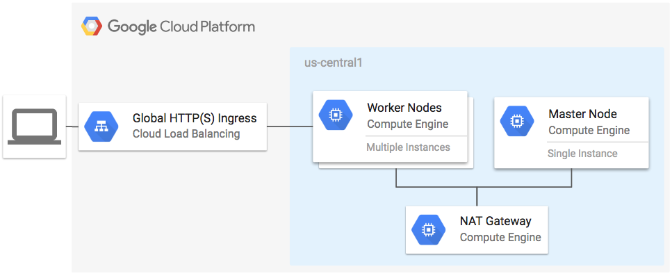

# Kubernetes Cluster on GCE Example with NAT Gateway and Calico CNI Networking

This example creates a Kunbernetes cluster on Compute Engine.

**Figure 1.** *diagram of Google Cloud resources*



## Set up the environment

```
gcloud auth application-default login
export GOOGLE_PROJECT=$(gcloud config get-value project)
```

## Run Terraform

```
terraform init
terraform plan
terraform apply
```

SSH into master through the nat gateway

```
export REGION=us-central1
gcloud compute ssh --ssh-flag="-A" \
  $(gcloud compute instances list --filter=nat-gateway-${REGION} --uri) \
  -- ssh -o UserKnownHostsFile=/dev/null -o StrictHostKeyChecking=no \
  $(gcloud compute instances list --filter='name~k8s-.*master.*' --format='get(name)')
```

Wait for kubeadm to complete:

```
until [[ -f /etc/kubernetes/admin.conf ]]; do echo "waiting for k8s install to complete..."; sleep 2; done
```

Configure kubectl:

```
mkdir -p $HOME/.kube
sudo cp -i /etc/kubernetes/admin.conf $HOME/.kube/config
sudo chown $(id -u):$(id -g) $HOME/.kube/config
```

Wait for all nodes to join and become Ready:

```
kubectl get nodes -o wide
```

## Run Example App with HTTP LoadBalancer

```
kubectl run nginx --image nginx --port 80
kubectl expose deployment nginx --port 80 --type=NodePort
```

```
kubectl create -f - <<'EOF'
apiVersion: extensions/v1beta1
kind: Ingress
metadata:
  name: basic-ingress
spec:
  backend:
    serviceName: nginx
    servicePort: 80
EOF
```

Wait a few minutes for the HTTP load balancer to be provisioned then curl the external IP.

```
until curl -sf http://$(kubectl get ing basic-ingress -o jsonpath='{.status.loadBalancer.ingress..ip}'); do echo "Waiting for LB..." ; sleep 2; done
```

## Open Kubernetes Dashboard

Copy the cluster credentials to your local host:

```
export REGION=us-central1
gcloud compute ssh --ssh-flag="-A" \
  $(gcloud compute instances list --filter=nat-gateway-${REGION} --uri) \
  -- ssh -o UserKnownHostsFile=/dev/null -o StrictHostKeyChecking=no \
    $(gcloud compute instances list --filter='name~k8s-.*master.*' --format='get(name)') \
    sudo cat /etc/kubernetes/admin.conf | \
    sed "s/$(terraform output -module k8s |grep master_ip | cut -d= -f2 | tr -d ' ')/127.0.0.1/g" \
    > ${HOME}/.kube/config
```

Create port-forward to apiserver:

```
export REGION=us-central1
gcloud compute ssh --ssh-flag="-A -L 6443:localhost:6443" \
  $(gcloud compute instances list --filter=nat-gateway-${REGION} --uri) \
  -- ssh -o UserKnownHostsFile=/dev/null -o StrictHostKeyChecking=no -L 6443:localhost:6443 $(gcloud compute instances list --filter='name~k8s-.*master.*' --format='get(name)')
```

Start kube proxy

```
kubectl proxy
```

Open dashboard:

```
open http://localhost:8001/ui
```

## (Optional) Trying a alpha or beta release

To try a beta release, set the `k8s_version_override` variable.

```
echo 'k8s_version_override = "1.9.0-beta.1"' >> terraform.tfvars
```

## Cleanup

Remove the ingress resource to delete the load balancer which is not cleaned up by Terraform.

```
kubectl delete ing basic-ingress
```

Remove all resources created by terraform:

```
terraform destroy
```
